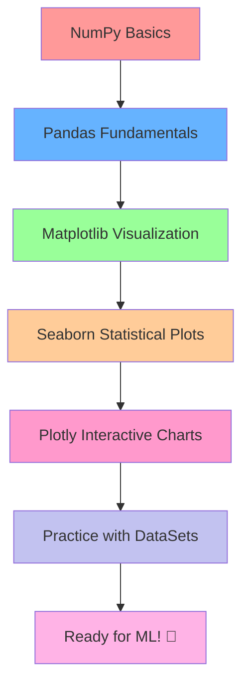

# 📚 Preparatory Topics for Machine Learning

Welcome to the **Preparatory Topics for Machine Learning** repository! This comprehensive collection covers essential foundational topics and tools that are crucial for anyone beginning their journey in Machine Learning.

## 🎯 Purpose

This repository serves as a complete preparatory guide covering the fundamental libraries and concepts you need to master before diving into Machine Learning algorithms. Each section includes practical examples, exercises, and real-world applications.

## 📁 Repository Structure

```
0.-Preparatory-Topics-for-ML/
├── Numpy/              # Numerical computing with Python
├── Pandas/             # Data manipulation and analysis
├── Matplotlib/         # Basic data visualization (Coming Soon!)
├── Seaborn/           # Statistical data visualization (Coming Soon!)
├── Plotly/            # Interactive data visualization (Coming Soon!)
├── DataSets/          # Sample datasets for practice
├── temp.ipynb         # Temporary notebook for experiments
└── README.md          # This file
```

## 🛠️ Topics Covered

### 1. **NumPy** 📊
- Array operations and manipulations
- Mathematical functions and operations
- Broadcasting and vectorization
- Linear algebra operations
- Random number generation
- Performance optimization techniques

### 2. **Pandas** 🐼
- DataFrames and Series fundamentals
- Data cleaning and preprocessing
- Data filtering, grouping, and aggregation
- Handling missing data and duplicates
- Time series analysis basics

### 3. **Matplotlib** 📈 *(Enhanced Section Coming Soon!)*
- Basic plotting fundamentals
- Customizing plots and charts
- Multiple plot types (line, bar, scatter, histogram, box plots)
- Subplots and figure management
- Statistical visualizations
- Advanced styling and themes

### 4. **Seaborn** 🎨 *(Coming Soon!)*
- Statistical data visualization
- Beautiful default styles and color palettes
- Distribution plots and correlation matrices
- Categorical data visualization
- Regression plots and model visualization
- Multi-plot grids and faceting

### 5. **Plotly** ⚡ *(Coming Soon!)*
- Interactive data visualization
- Dynamic charts and dashboards
- 3D plotting capabilities
- Geographic data visualization
- Animation and real-time updates
- Web-based interactive plots

### 6. **DataSets** 📂
- Sample datasets for hands-on practice
- Real-world data examples
- Industry-standard datasets

## 🚀 Getting Started

### Prerequisites
```bash
# Current requirements
pip install numpy pandas matplotlib jupyter

# Full requirements (when all sections are complete)
pip install numpy pandas matplotlib seaborn plotly jupyter
```

### How to Use This Repository
1. **Clone the repository**
   ```bash
   git clone https://github.com/DevRitesh08/0.-Preparatory-Topics-for-ML.git
   cd 0.-Preparatory-Topics-for-ML
   ```

2. **Start with Jupyter Notebook**
   ```bash
   jupyter notebook
   ```

3. **Follow the recommended learning path**:
   - Begin with **NumPy** fundamentals
   - Progress to **Pandas** for data manipulation
   - Master **Matplotlib** for basic visualization
   - Advance to **Seaborn** for statistical plots
   - Explore **Plotly** for interactive visualizations
   - Practice with provided datasets

## 📖 Learning Path



## 🎓 What You'll Learn

By completing this preparatory course, you will:

- ✅ Master NumPy for numerical computations and array operations
- ✅ Become proficient in data manipulation and analysis with Pandas
- ✅ Create basic to advanced visualizations with Matplotlib
- 🔄 **Coming Soon:** Design beautiful statistical plots with Seaborn
- 🔄 **Coming Soon:** Build interactive dashboards with Plotly
- ✅ Handle real-world datasets confidently
- ✅ Build a solid foundation for Machine Learning

## 🔧 Tools & Technologies

### Currently Available:
- **Python 3.x**
- **Jupyter Notebook**
- **NumPy** - Numerical computing
- **Pandas** - Data analysis and manipulation
- **Matplotlib** - Basic data visualization

### Coming Soon:
- **Seaborn** - Statistical data visualization
- **Plotly** - Interactive data visualization

## 📊 Visualization Comparison

| Library | Best For | Interactivity | Learning Curve |
|---------|----------|---------------|----------------|
| **Matplotlib** | Basic plots, customization | Static | Medium |
| **Seaborn** | Statistical analysis | Static | Easy |
| **Plotly** | Interactive dashboards | High | Medium |

## 🚧 Development Roadmap

- [x] NumPy fundamentals
- [x] Pandas data manipulation
- [x] Basic Matplotlib plotting
- [ ] **Enhanced Matplotlib section** (In Progress)
- [ ] **Seaborn statistical visualization** (Planned)
- [ ] **Plotly interactive charts** (Planned)
- [ ] **Advanced datasets and projects** (Future)

## 📚 Additional Resources

- [NumPy Documentation](https://numpy.org/doc/)
- [Pandas Documentation](https://pandas.pydata.org/docs/)
- [Matplotlib Documentation](https://matplotlib.org/stable/)
- [Seaborn Documentation](https://seaborn.pydata.org/)
- [Plotly Documentation](https://plotly.com/python/)

## 🤝 Contributing

Feel free to contribute to this repository by:
- Adding new examples or exercises
- Improving existing notebooks
- Suggesting new datasets
- Helping with the upcoming Seaborn and Plotly sections
- Reporting issues or bugs

## 📝 License

This project is licensed under the Apache License 2.0 - see the [LICENSE](LICENSE) file for details.

## 👨‍💻 Author

**DevRitesh08**
- GitHub: [@DevRitesh08](https://github.com/DevRitesh08)

## 🌟 Related Repositories

Check out my other learning resources:
- 🤖 [Machine Learning Repository](https://github.com/DevRitesh08/Machine-Learning)
- 📝 [Git Guide](https://github.com/DevRitesh08/GitGuide)
- 🔒 [Anonymous Reputation System](https://github.com/DevRitesh08/AnonymousReputationSystem)

---

## 📅 Recent Updates

**Last Updated: September 2025**
- Enhanced README structure
- Added roadmap for Seaborn and Plotly
- Improved learning path visualization
- Added comparison table for visualization libraries

---

⭐ **Star this repository if you find it helpful!** ⭐

*Happy Learning! 🚀*

**Stay tuned for exciting updates with Seaborn and Plotly!** 🎨⚡
