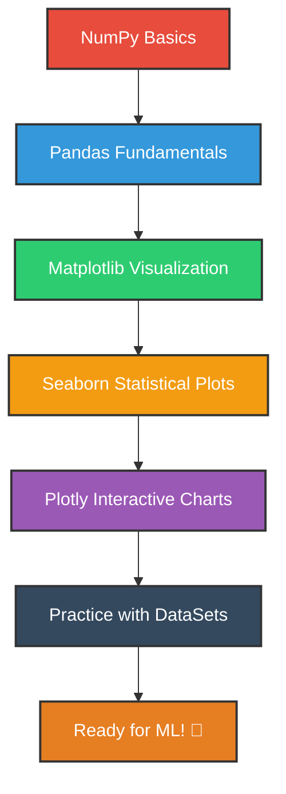

# 📚 Preparatory Topics for Machine Learning

Welcome to the **Preparatory Topics for Machine Learning** repository! This comprehensive collection covers essential foundational topics and tools that are crucial for anyone beginning their journey into Machine Learning.

## 🎯 Purpose

This repository serves as a complete preparatory guide covering the fundamental libraries and concepts you need to master before diving into Machine Learning algorithms. Each section includes practical examples, explanations, and hands-on notebooks.

## 📁 Repository Structure

```
0.-Preparatory-Topics-for-ML/
├── Numpy/              # Numerical computing with Python
├── Pandas/             # Data manipulation and analysis
├── Matplotlib/         # Basic data visualization
├── Seaborn/            # Statistical data visualization
├── Plotly/             # Interactive data visualization
├── DataSets/           # Sample datasets for practice
├── temp.ipynb          # Temporary notebook for experiments
└── README.md           # This file
```

## 🛠️ Topics Covered

### 1. **NumPy** 📊
- Array operations and manipulations
- Mathematical functions and operations
- Broadcasting and vectorization
- Linear algebra operations
- Random number generation
- Performance optimization techniques

### 2. **Pandas** 🐼
- DataFrames and Series fundamentals
- Data cleaning and preprocessing
- Data filtering, grouping, and aggregation
- Handling missing data and duplicates
- Time series analysis basics

### 3. **Matplotlib** 📈
- Basic plotting fundamentals
- Customizing plots and charts
- Multiple plot types (line, bar, scatter, histogram, box plots)
- Subplots and figure management
- Statistical visualizations
- Advanced styling and themes

### 4. **Seaborn** 🎨
- Statistical data visualization
- Beautiful default styles and color palettes
- Distribution plots and correlation matrices
- Categorical data visualization
- Regression plots and model visualization
- Multi-plot grids and faceting

### 5. **Plotly** ⚡
- Interactive data visualization
- Dynamic charts and dashboards
- 3D plotting capabilities
- Geographic data visualization
- Animation and real-time updates
- Web-based interactive plots

### 6. **DataSets** 📂
- Sample datasets for hands-on practice
- Real-world data examples
- Industry-standard datasets

## 🚀 Getting Started

### Prerequisites
```bash
pip install numpy pandas matplotlib seaborn plotly jupyter
```

### How to Use This Repository
1. **Clone the repository**
   ```bash
   git clone https://github.com/DevRitesh08/0.-Preparatory-Topics-for-ML.git
   cd 0.-Preparatory-Topics-for-ML
   ```
2. **Start with Jupyter Notebook**
   ```bash
   jupyter notebook
   ```
3. **Follow the recommended learning path**:
   - Begin with **NumPy** fundamentals
   - Progress to **Pandas** for data manipulation
   - Master **Matplotlib** for basic visualization
   - Advance to **Seaborn** for statistical plots
   - Explore **Plotly** for interactive visualizations
   - Practice with provided datasets

## 📖 Learning Path



## 🎓 What You'll Learn

By completing this preparatory course, you will:

- ✅ Master NumPy for numerical computations and array operations
- ✅ Become proficient in data manipulation and analysis with Pandas
- ✅ Create basic to advanced visualizations with Matplotlib
- ✅ Design beautiful statistical plots with Seaborn
- ✅ Build interactive dashboards with Plotly
- ✅ Handle real-world datasets confidently
- ✅ Build a solid foundation for Machine Learning

## 🔧 Tools & Technologies

### Available:
- **Python 3.x**
- **Jupyter Notebook**
- **NumPy** - Numerical computing
- **Pandas** - Data analysis and manipulation
- **Matplotlib** - Data visualization
- **Seaborn** - Statistical data visualization
- **Plotly** - Interactive data visualization

## 📊 Visualization Comparison

| Library        | Best For                    | Interactivity | Learning Curve |
|----------------|----------------------------|---------------|---------------|
| **Matplotlib** | Basic plots, customization | Static        | Medium        |
| **Seaborn**    | Statistical analysis       | Static        | Easy          |
| **Plotly**     | Interactive dashboards     | High          | Medium        |

## 🚧 Development Roadmap

- [x] NumPy fundamentals
- [x] Pandas data manipulation
- [x] Basic Matplotlib plotting
- [x] Enhanced Matplotlib section
- [x] Seaborn statistical visualization
- [x] Plotly interactive charts
- [x] Advanced datasets and projects

## 📚 Additional Resources

- [NumPy Documentation](https://numpy.org/doc/)
- [Pandas Documentation](https://pandas.pydata.org/docs/)
- [Matplotlib Documentation](https://matplotlib.org/stable/)
- [Seaborn Documentation](https://seaborn.pydata.org/)
- [Plotly Documentation](https://plotly.com/python/)

## 🤝 Contributing

Feel free to contribute to this repository by:
- Adding new examples or exercises
- Improving existing notebooks
- Suggesting new datasets
- Reporting issues or bugs

## 📝 License

This project is licensed under the Apache License 2.0 - see the [LICENSE](LICENSE) file for details.

## 👨‍💻 Author

**DevRitesh08**
- GitHub: [@DevRitesh08](https://github.com/DevRitesh08)

---

## 🌟 Related Repositories

Check out my other learning resources:
- 🤖 [Machine Learning Repository](https://github.com/DevRitesh08/Machine-Learning)
- 📝 [DSA](https://github.com/DevRitesh08/DSA)
- 🔒 [PYTHON-SPACE](https://github.com/DevRitesh08/PYTHON-SPACE)
- 💾 [SQL](https://github.com/DevRitesh08/SQL)

---

## 📅 Recent Updates

**Last Updated: September 2025**
- All planned sections completed!
- Enhanced README structure
- Improved learning path visualization
- Added comparison table for visualization libraries

---

⭐ **Star this repository if you find it helpful!** ⭐
